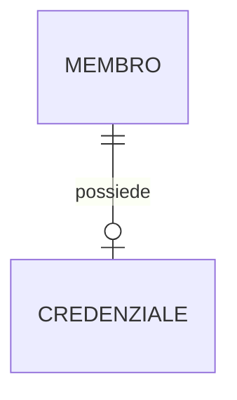
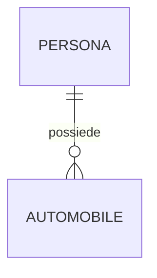
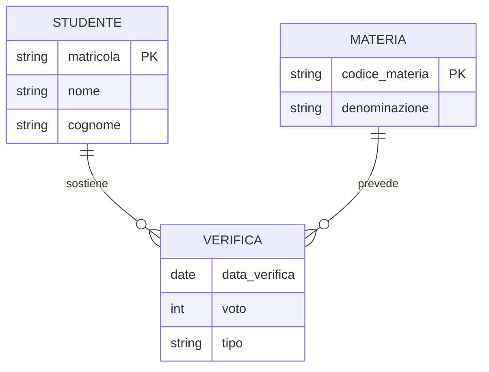
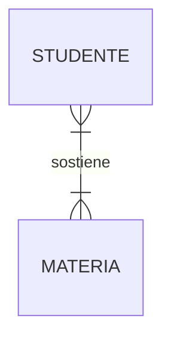

# Esercizi svolti — Dal modello E/R al modello relazionale

> **Corso:** Informatica (Programmazione) · Anno 5 · Modulo 1 · Lezione 03 — Modello relazionale
> **File:** `pr-a5-m1-l03-es-traduzione-er-relazionale.md`
> **Percorso repository suggerito:** `programmazione-labs/a5-m1-l03/`
>
> I diagrammi sono in sintassi [Mermaid](https://mermaid.js.org/syntax/entityRelationshipDiagram.html): GitHub li renderizza automaticamente. Obiettivo: applicare le 3 regole di traduzione: Entità → Tabella, 1:1 / 1:N → Chiave esterna, N:M → Tabella associativa.

## Come leggere gli esercizi

Per ogni esercizio seguiamo 6 passi:

1.  **Individuazione di entità e associazione** — cosa sono gli oggetti coinvolti
2.  **Analisi dell'associazione in un senso** — presa un'istanza di A, quante istanze di B può coinvolgere? Da qui ricaviamo min/max e molteplicità
3.  **Analisi nell'altro senso** — presa un'istanza di B, quante istanze di A può coinvolgere? Da qui ricaviamo partecipazione obbligatoria/facoltativa
4.  **Schema E/R** in Mermaid
5.  **Derivazione delle tabelle** — dove mettiamo la FK? Serve tabella ponte?
6.  **Schema relazionale** — notazione `NOME(<u>PK</u>, attributi, FK)` con PK sottolineata

> **Convenzione schema relazionale:** `<u>attributo</u>` = Chiave Primaria (PK). `FK → TABELLA` = Chiave Esterna. Se la PK è composta: `<u>id1, id2</u>`. Ricorda: R ⊆ D1 × D2 × ... × Dn, solo la relazione contiene informazioni utili, non tutto il prodotto cartesiano.

---

## Esercizio 1 — Membro e Credenziali [Obiettivo: tradurre associazione 1:1]

**Testo.** In un team di sviluppo di siti web, ad alcuni membri (gli amministratori) sono associate delle credenziali di accesso al pannello (username e password). Ad altri membri (non amministratori) non è associata nessuna credenziale. Ogni credenziale appartiene a un solo membro.

### Analisi

**Entità individuate:** `MEMBRO`, `CREDENZIALE`
**Associazione:** `POSSIEDE`
**Attributi:**
* `MEMBRO(id_membro, nome, cognome, ruolo)`
* `CREDENZIALE(id_credenziale, username, password, data_creazione)`

**Analisi in un senso — da MEMBRO a CREDENZIALE.**
Preso un MEMBRO, quante CREDENZIALI possiede? Un membro non amministratore ne ha 0, un amministratore ne ha 1.
- Min: **0**, Max: **1** → Cardinalità **(0,1)** - partecipazione facoltativa

**Analisi nell'altro senso — da CREDENZIALE a MEMBRO.**
Presa una CREDENZIALE, a quanti MEMBRO appartiene? Una credenziale non può esistere da sola, deve sempre appartenere a uno e un solo membro.
- Min: **1**, Max: **1** → Cardinalità **(1,1)** - partecipazione obbligatoria

Riassumendo: è una **associazione 1:1** con opzionalità su un solo lato: `(0,1)` lato MEMBRO, `(1,1)` lato CREDENZIALE.

### Schema E/R



*Lettura: un MEMBRO possiede zero o una CREDENZIALE; una CREDENZIALE è posseduta da esattamente un MEMBRO.*

### Derivazione delle tabelle

Regola 1:1 — due strategie possibili:
1.  Unica tabella (se partecipazione (1,1) su entrambi i lati)
2.  Due tabelle con FK (scelta corretta qui)

Non uniamo perché la maggior parte dei membri non ha credenziali: avremmo molti NULL su username/password. Creiamo due tabelle.

Dove metto la FK? La metto nella tabella con cardinalità **(1,1)** per evitare NULL: `CREDENZIALE` deve avere sempre un membro, quindi `CREDENZIALE.id_membro` sarà `NOT NULL` e `UNIQUE` per garantire l'1:1.

### Schema relazionale

```
MEMBRO(<u>id_membro</u>, nome, cognome, ruolo)
CREDENZIALE(<u>id_credenziale</u>, username, password, data_creazione, id_membro)

Vincoli:
CREDENZIALE.id_membro → MEMBRO.id_membro  (FK, NOT NULL, UNIQUE)
CREDENZIALE.username UNIQUE
```

**Istanza d'esempio:**

**MEMBRO**
| id_membro | nome | ruolo |
|---|---|---|
| M01 | Anna | admin |
| M02 | Luca | developer |

**CREDENZIALE**
| id_credenziale | username | id_membro |
|---|---|---|
| C01 | anna.admin | M01 |

> M02 non ha riga in CREDENZIALE → rispetta (0,1). Grado MEMBRO=3, grado CREDENZIALE=5.

---

## Esercizio 2 — Persona e Automobile [Obiettivo: tradurre associazione 1:N]

**Testo.** Un sistema per la gestione di un parco auto: ogni persona può possedere zero, una o più automobili. Ogni automobile è posseduta da esattamente una persona.

### Analisi

**Entità individuate:** `PERSONA`, `AUTOMOBILE`
**Associazione:** `POSSIEDE`

**Analisi in un senso — da PERSONA a AUTOMOBILE.**
Presa una PERSONA, quante AUTOMOBILE possiede? Può non averne, o averne molte.
- Min: **0**, Max: **N** → **(0,N)** - facoltativa

**Analisi nell'altro senso — da AUTOMOBILE a PERSONA.**
Presa una AUTOMOBILE, quante PERSONA la possiedono? Deve avere sempre un proprietario, uno solo.
- Min: **1**, Max: **1** → **(1,1)** - obbligatoria

Riassumendo: **associazione 1:N** — `(0,N)` lato PERSONA, `(1,1)` lato AUTOMOBILE.

### Schema E/R



*Lettura: una PERSONA possiede zero o N AUTOMOBILI; una AUTOMOBILE è posseduta da esattamente una PERSONA.*

### Derivazione delle tabelle

Regola 1:N → **La chiave esterna va sempre nel lato N**.

Non serve tabella associativa. Creiamo `PERSONA` e `AUTOMOBILE`. In `AUTOMOBILE` aggiungiamo `id_persona` come FK.

Perché non nell'altro senso? Se mettessi `id_automobile` in `PERSONA` dovrei mettere più valori in una cella (es. "AB123, EF456") o duplicare la persona → violazione 1ª forma normale (valori atomici).

### Schema relazionale

```
PERSONA(<u>id_persona</u>, nome, cognome, codice_fiscale)
AUTOMOBILE(<u>targa</u>, modello, anno, id_persona)

Vincoli:
AUTOMOBILE.id_persona → PERSONA.id_persona (FK, NOT NULL)
PERSONA.codice_fiscale UNIQUE
```

**Istanza d'esempio:**

**PERSONA**
| id_persona | cognome |
|---|---|
| P01 | Bianchi |
| P02 | Rossi |

**AUTOMOBILE**
| targa | modello | id_persona |
|---|---|---|
| AB123CD | Panda | P01 |
| EF456GH | 500 | P01 |
| IJ789KL | Ypsilon | P02 |

> P01 partecipa 2 volte → verifica (0,N). Ogni auto ha una sola FK → verifica (1,1).

---

## Esercizio 3 — Studente, Materia e Verifiche [Obiettivo: tradurre associazione N:M]

**Testo.** In un registro elettronico sono memorizzate le verifiche sostenute dagli studenti di una classe in un anno scolastico su diverse materie. Uno studente sostiene verifiche in più materie; per ogni materia ci sono verifiche di più studenti. Di ogni verifica vogliamo data, voto e tipo (scritto, orale, pratico).

### Analisi

**Entità individuate:** `STUDENTE`, `MATERIA`
**Associazione:** `SOSTIENE` con attributi `data_verifica, voto, tipo`

**Analisi in un senso — da STUDENTE a MATERIA.**
Preso uno STUDENTE, in quante MATERIE sostiene verifiche? Almeno una (se iscritto), potenzialmente tutte.
- Min: **1**, Max: **N** → **(1,N)** - obbligatoria

**Analisi nell'altro senso — da MATERIA a STUDENTE.**
Presa una MATERIA, quanti STUDENTI vi sostengono verifiche? Almeno uno, tipicamente tutti.
- Min: **1**, Max: **N** → **(1,N)** - obbligatoria

Riassumendo: **associazione N:M** obbligatoria su entrambi i lati. Gli attributi `data, voto, tipo` non appartengono né a STUDENTE né a MATERIA, ma alla verifica stessa.

### Schema E/R

Per modellare gli attributi dell'associazione usiamo un'entità associativa `VERIFICA`.



Variante classica N:M pura:



### Derivazione delle tabelle

Regola N:M → **Serve una tabella associativa (ponte)**.

Non possiamo mettere una FK in STUDENTE né in MATERIA: violeremmo la 1ª forma normale.

Creiamo 3 tabelle:
1.  `STUDENTE`
2.  `MATERIA`
3.  `VERIFICA` che contiene le due FK + gli attributi propri dell'associazione.

Qual è la PK di VERIFICA? Due scelte valide in classe:

**Soluzione A (didattica, PK composta):** `<u>matricola, codice_materia, data_verifica</u>` — uno studente non può avere due verifiche della stessa materia nello stesso giorno.
**Soluzione B (professionale, surrogata):** `<u>id_verifica</u>` + UNIQUE(matricola, codice_materia, data_verifica)

Usiamo la A per l'esercizio perché mostra bene il concetto di relazione come sottoinsieme del prodotto cartesiano.

### Schema relazionale

```
STUDENTE(<u>matricola</u>, nome, cognome, classe)
MATERIA(<u>codice_materia</u>, denominazione, docente)
VERIFICA(<u>matricola, codice_materia, data_verifica</u>, voto, tipo)

Vincoli:
VERIFICA.matricola → STUDENTE.matricola (FK)
VERIFICA.codice_materia → MATERIA.codice_materia (FK)
VERIFICA.voto CHECK (voto >=1 AND voto <=10)
VERIFICA.tipo IN ('scritto','orale','pratico')
```

**Istanza d'esempio:**

**STUDENTE**
| matricola | cognome | classe |
|---|---|---|
| S001 | Verdi | 5A |
| S002 | Neri | 5A |

**MATERIA**
| codice_materia | denominazione |
|---|---|
| INF | Informatica |
| ITA | Italiano |

**VERIFICA**
| matricola | codice_materia | data_verifica | voto | tipo |
|---|---|---|
| S001 | INF | 2025-11-10 | 8 | scritto |
| S001 | ITA | 2025-11-12 | 7 | orale |
| S002 | INF | 2025-11-10 | 6 | scritto |
| S002 | INF | 2025-12-02 | 7 | orale |

> Uno studente ha N verifiche, una materia ha N verifiche, ma ogni riga di VERIFICA è unica grazie alla PK composta. È esattamente la traduzione dell'N:M. Grado VERIFICA = 5, Cardinalità = 4.

---

## Tabella riepilogativa traduzione E/R → Relazionale

| Esercizio | Tipo | Cardinalità | Traduzione | Dove va la FK? |
|---|---|---|---|---|
| 1. Membro-Credenziale | 1:1 | (0,1) / (1,1) | 2 tabelle, FK con UNIQUE lato obbligatorio | In CREDENZIALE |
| 2. Persona-Automobile | 1:N | (0,N) / (1,1) | 2 tabelle | In AUTOMOBILE (lato N) |
| 3. Studente-Materia | N:M | (1,N) / (1,N) | 3 tabelle, tabella ponte VERIFICA | Due FK nella ponte |

> **Regola d'oro da ricordare:** 1:1 → FK con UNIQUE (evita NULL mettendola lato obbligatorio), 1:N → FK lato N, N:M → tabella associativa con PK composta dalle due FK.
