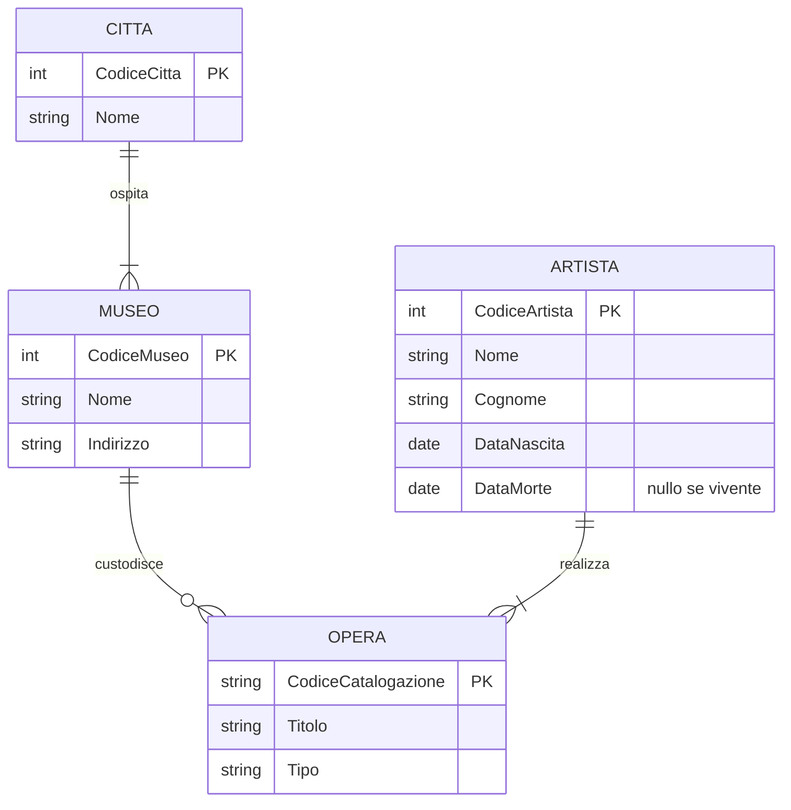
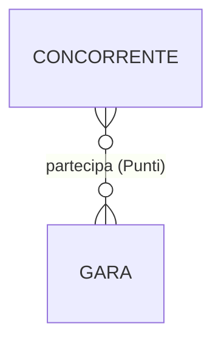
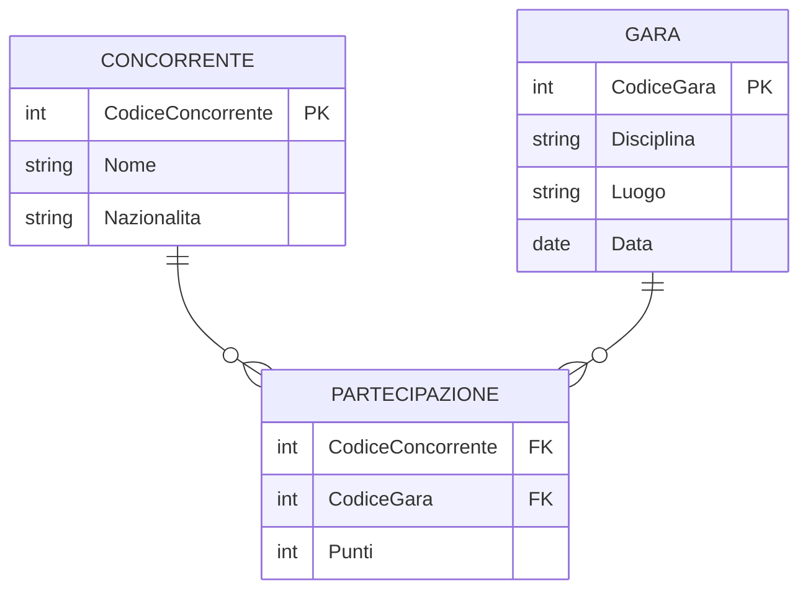
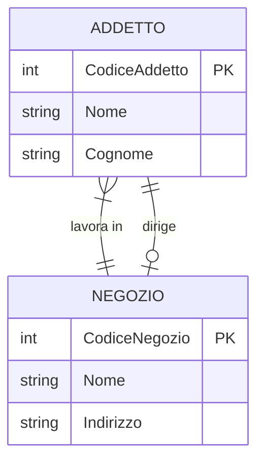

# Esercizi svolti — Analisi del problema e modellazione dei dati

> **Corso:** Informatica (Programmazione) · Anno 5 · Modulo 1 · Lezione 02 — Diagrammi E/R
> **File:** `pr-a5-m1-l02-es-analisi-problema-modellazione-dati.md`
> **Percorso repository suggerito:** `programmazione-labs/a5-m1-l02/`
>
> I diagrammi in questo file sono scritti in sintassi [Mermaid](https://mermaid.js.org/syntax/entityRelationshipDiagram.html): GitHub li renderizza automaticamente nella pagina del repository, senza bisogno di immagini esterne.

## Il metodo: dall'analisi alla verifica

A differenza degli esercizi del file precedente — dove entità e associazione erano già indicate nel testo — qui il lavoro comincia da una descrizione libera del problema, in linguaggio naturale. Il procedimento che seguiamo è sempre lo stesso:

1. **Analisi del testo**, individuando e motivando entità e associazioni (non è mai un passaggio automatico: richiede di interpretare la realtà descritta)
2. **Attributi** delle entità e delle eventuali associazioni
3. **Cardinalità** di ogni associazione, ragionata come nel file precedente
4. **Disegno del diagramma E/R**
5. **Verifica con le regole di lettura**: si rilegge ogni associazione, in entrambi i sensi, trasformando la cardinalità in una frase di senso compiuto, e si controlla che quella frase corrisponda esattamente a quanto richiesto dal testo originale. È il passaggio che più spesso viene saltato, ed è anche quello che smaschera più errori.

---

## Esercizio 1 — Catalogazione opere d'arte

**Testo.** In una stessa città ci possono essere più musei. Le opere possono essere di tipo diverso (tele, sculture, ecc.). Ogni artista può avere più opere in diversi musei, e in ogni museo ci possono essere opere di artisti diversi. Per l'epoca si registrano data di nascita dell'artista e data di morte (nulla se è vivente). Ogni opera ha un codice di catalogazione.

### Analisi del testo

Leggendo il testo frase per frase, individuiamo quattro concetti che meritano di diventare entità:

- **CITTÀ** — perché il testo distingue esplicitamente "una stessa città" da altre città, e le mette in relazione con più musei: è un concetto autonomo, non un semplice attributo del museo (in un'altra versione del problema, più semplice, si potrebbe anche ridurre "città" a un attributo testuale di MUSEO — qui la teniamo separata perché il testo la tratta esplicitamente come contenitore di più musei).
- **MUSEO** — luogo fisico che custodisce le opere.
- **ARTISTA** — persona che realizza le opere; ha attributi propri (data di nascita, data di morte) che non avrebbe senso associare a nient'altro.
- **OPERA** — l'oggetto catalogato, con un proprio codice univoco (il codice di catalogazione, che ne è la chiave primaria naturale).

Il "tipo" dell'opera (tela, scultura...) non genera una nuova entità: nel testo non ha attributi propri né entra in relazione con altro, quindi lo trattiamo come un semplice **attributo** di OPERA.

Le associazioni che emergono dal testo:

- **CITTÀ — OSPITA — MUSEO**: "in una stessa città ci possono essere più musei"
- **MUSEO — CUSTODISCE — OPERA**: "in ogni museo ci possono essere opere di artisti diversi" (implica che un museo contiene più opere)
- **ARTISTA — REALIZZA — OPERA**: "ogni artista può avere più opere in diversi musei" (implica che un'opera è realizzata da un artista)

### Cardinalità

**OSPITA (CITTÀ — MUSEO).** Per una città, quanti musei? Il testo dice "possono essere più musei": assumiamo che si registrino solo città che ospitano effettivamente almeno un museo (altrimenti la città non comparirebbe nel nostro sistema) → **(1,N)** per CITTÀ. Per un museo, quante città? Esattamente una, un museo ha un solo indirizzo fisico → **(1,1)** per MUSEO.

**CUSTODISCE (MUSEO — OPERA).** Per un museo, quante opere? Il testo non esclude un museo appena censito e ancora privo di opere catalogate → **(0,N)** per MUSEO. Per un'opera, quanti musei? Esattamente uno, un'opera fisica si trova in un solo luogo → **(1,1)** per OPERA.

**REALIZZA (ARTISTA — OPERA).** Per un artista, quante opere? Il testo dice "può avere più opere": assumiamo che si registrino solo artisti con almeno un'opera catalogata → **(1,N)** per ARTISTA. Per un'opera, quanti artisti? Esattamente uno — il testo non menziona opere realizzate a più mani, quindi non lo consideriamo → **(1,1)** per OPERA.

### Attributi

- `CITTÀ`: CodiceCittà (PK), Nome
- `MUSEO`: CodiceMuseo (PK), Nome, Indirizzo
- `ARTISTA`: CodiceArtista (PK), Nome, Cognome, DataNascita, DataMorte *(nullo se l'artista è vivente)*
- `OPERA`: CodiceCatalogazione (PK), Titolo, Tipo

### Schema E/R

### Verifica con le regole di lettura

Rileggiamo ogni associazione in entrambi i sensi, trasformando la cardinalità in una frase, e la confrontiamo con il testo originale:

| Associazione | Lettura → | Corrisponde al testo? |
|---|---|---|
| OSPITA | "Una città ospita una o più musei" | ✓ — "in una stessa città ci possono essere più musei" |
| OSPITA | "Un museo si trova in esattamente una città" | ✓ — coerente, non contraddetto dal testo |
| CUSTODISCE | "Un museo custodisce zero o più opere" | ✓ — coerente con "in ogni museo ci possono essere opere" |
| CUSTODISCE | "Un'opera è custodita in esattamente un museo" | ✓ — coerente, un oggetto fisico ha un solo luogo |
| REALIZZA | "Un artista realizza una o più opere" | ✓ — "ogni artista può avere più opere" |
| REALIZZA | "Un'opera è realizzata da esattamente un artista" | ✓ — nessuna menzione di opere collettive nel testo |

Nessuna delle sei letture entra in contraddizione con il testo: il modello è verificato.

> **Nota didattica.** Vale la pena far notare in classe che "in ogni museo ci possono essere opere di artisti diversi" **non** genera una relazione diretta tra MUSEO e ARTISTA: è una conseguenza automatica del fatto che MUSEO e ARTISTA sono collegati solo indirettamente, tramite OPERA. Introdurre una relazione diretta MUSEO-ARTISTA sarebbe un errore di ridondanza concettuale.

---

## Esercizio 2 — Campionato internazionale

**Testo.** Si vogliono registrare informazioni sui risultati di gare sportive di un campionato internazionale, che si svolge in diverse località del mondo in date diverse dell'anno (es. Formula 1 in Italia a ottobre, Sci in Francia a luglio, ecc.). In ogni gara i concorrenti possono guadagnare punti, che a fine campionato determinano il vincitore.

### Analisi del testo

Le entità coinvolte:

- **CONCORRENTE** — l'atleta o la squadra che partecipa alle gare.
- **GARA** — un singolo evento sportivo, con una propria disciplina, un luogo e una data.

Non introduciamo un'entità "Disciplina" separata: nel testo la disciplina (Formula 1, Sci...) è sempre associata a una singola gara e non ha attributi o relazioni proprie — la trattiamo come attributo di GARA. Allo stesso modo non introduciamo un'entità "Campionato": il testo parla di un solo campionato alla volta, quindi non serve modellarlo come entità distinta (se il sistema dovesse gestire più campionati in anni diversi, questa scelta andrebbe rivista).

L'associazione tra le due entità è **PARTECIPA**: "in ogni gara i concorrenti possono guadagnare punti" — punti che dipendono dalla *combinazione specifica* di un concorrente e di una gara, non dal concorrente da solo (un concorrente ha punteggi diversi in gare diverse) né dalla gara da sola (concorrenti diversi guadagnano punteggi diversi nella stessa gara). Per questo motivo **Punti è un attributo dell'associazione**, non di una delle due entità.

### Cardinalità

**PARTECIPA (CONCORRENTE — GARA).** Per un concorrente, a quante gare partecipa? Il testo non pone limiti: potrebbe anche non aver ancora partecipato a nessuna gara del campionato → **(0,N)** per CONCORRENTE. Per una gara, quanti concorrenti vi partecipano? Una gara potrebbe, in teoria, non avere ancora concorrenti iscritti al momento della registrazione → **(0,N)** per GARA.

È quindi un'associazione **molti-a-molti**, con l'attributo Punti che vive esclusivamente sull'associazione stessa.

### Attributi

- `CONCORRENTE`: CodiceConcorrente (PK), Nome, Nazionalità
- `GARA`: CodiceGara (PK), Disciplina, Luogo, Data
- attributo dell'associazione `PARTECIPA`: Punti

### Schema E/R

Concettualmente, l'associazione porta con sé l'attributo Punti:

In vista della traduzione verso lo schema logico, un'associazione molti-a-molti con attributo proprio viene sempre rappresentata tramite un'**entità associativa** dedicata — è la stessa tecnica che useremo quando tradurremo questo schema in tabelle relazionali:

### Verifica con le regole di lettura

| Associazione | Lettura → | Corrisponde al testo? |
|---|---|---|
| PARTECIPA | "Un concorrente partecipa a zero o più gare" | ✓ — nessun vincolo contrario nel testo |
| PARTECIPA | "Una gara è disputata da zero o più concorrenti" | ✓ — nessun vincolo contrario nel testo |
| PARTECIPA (attributo) | "Ogni combinazione concorrente-gara ha un proprio punteggio" | ✓ — "i concorrenti possono guadagnare punti" in ogni gara |

> **Nota didattica.** "Il vincitore del campionato" **non** è un'entità né un attributo da memorizzare direttamente: è un dato **derivato**, calcolabile sommando i Punti di ciascun concorrente su tutte le sue partecipazioni e prendendo il massimo. È un'occasione utile per introdurre agli studenti la differenza tra dato memorizzato e dato calcolabile a partire da altri — un concetto che ritroveranno parlando di viste e di query di aggregazione.

---

## Esercizio 3 — Catena di negozi

**Testo.** Una catena ha diversi negozi. Ogni negozio ha un responsabile che lo dirige e coordina altri addetti. Il responsabile è unico e dirige un solo negozio.

### Analisi del testo

Le entità coinvolte:

- **NEGOZIO** — il punto vendita.
- **ADDETTO** — la persona che lavora in un negozio, responsabile compreso.

Un punto delicato di questo esercizio è decidere **se il "responsabile" sia un'entità diversa da "addetto"**, oppure lo stesso tipo di oggetto con un ruolo particolare. Il testo dice che il responsabile "dirige e coordina altri addetti": questo implica che il responsabile è **anch'esso un addetto**, semplicemente con un ruolo aggiuntivo rispetto agli altri. Non ha quindi senso creare un'entità RESPONSABILE separata: sarebbe una duplicazione, perché un responsabile condivide tutti gli attributi di un normale addetto (nome, cognome...) e ne aggiunge solo il ruolo direttivo.

Modelliamo perciò **due associazioni distinte** tra le stesse due entità ADDETTO e NEGOZIO:

- **LAVORA_IN** — la relazione generica di appartenenza: ogni addetto (compreso il responsabile) lavora in un negozio.
- **DIRIGE** — la relazione specifica di direzione: solo alcuni addetti (i responsabili) dirigono un negozio.

### Cardinalità

**LAVORA_IN (ADDETTO — NEGOZIO).** Per un addetto, in quanti negozi lavora? Il testo non lo dice esplicitamente, ma il contesto (una catena con addetti assegnati a un punto vendita) suggerisce **esattamente uno** → **(1,1)** per ADDETTO. Per un negozio, quanti addetti vi lavorano? Il testo dice che il responsabile "coordina altri addetti", quindi un negozio ha sempre più di una persona → **(1,N)** per NEGOZIO.

**DIRIGE (ADDETTO — NEGOZIO).** Per un addetto, quanti negozi dirige? Il testo è esplicito: "il responsabile è unico e dirige un solo negozio" — ma non tutti gli addetti sono responsabili → **(0,1)** per ADDETTO. Per un negozio, quanti addetti lo dirigono? Il testo dice che "ogni negozio ha un responsabile", al singolare e in modo obbligatorio → **(1,1)** per NEGOZIO.

### Attributi

- `ADDETTO`: CodiceAddetto (PK), Nome, Cognome
- `NEGOZIO`: CodiceNegozio (PK), Nome, Indirizzo

### Schema E/R

### Verifica con le regole di lettura

| Associazione | Lettura → | Corrisponde al testo? |
|---|---|---|
| LAVORA_IN | "Un addetto lavora in esattamente un negozio" | ✓ — coerente con il contesto della catena |
| LAVORA_IN | "Un negozio ha uno o più addetti" | ✓ — "il responsabile ... coordina altri addetti" implica più di una persona |
| DIRIGE | "Un addetto dirige zero o un negozio" | ✓ — "il responsabile è unico e dirige un solo negozio", ma non tutti sono responsabili |
| DIRIGE | "Un negozio è diretto da esattamente un addetto" | ✓ — "ogni negozio ha un responsabile" (singolare, obbligatorio) |

> **Nota didattica.** Questo esercizio è un ottimo esempio di **due associazioni distinte tra le stesse due entità**, un pattern che gli studenti tendono a sottovalutare la prima volta che lo incontrano (spesso provano a "forzare" tutto dentro un'unica associazione con un attributo booleano "è_responsabile", che però non è corretto: non cattura la cardinalità (1,1) di NEGOZIO in DIRIGE). Vale la pena confrontarlo con il caso analogo — porto di partenza/arrivo di un viaggio — incontrato nella lezione sulla progettazione di basi di dati.

---

## Tabella riepilogativa

| Esercizio | Entità | Associazioni | Punto di attenzione principale |
|---|---|---|---|
| 1. Catalogazione opere d'arte | CITTÀ, MUSEO, ARTISTA, OPERA | OSPITA, CUSTODISCE, REALIZZA | Il "tipo" dell'opera resta attributo, non entità; nessuna relazione diretta MUSEO-ARTISTA |
| 2. Campionato internazionale | CONCORRENTE, GARA | PARTECIPA (con attributo Punti) | Attributo sull'associazione molti-a-molti; il vincitore è un dato derivato, non memorizzato |
| 3. Catena di negozi | ADDETTO, NEGOZIO | LAVORA_IN, DIRIGE | Il responsabile non è un'entità separata; due associazioni distinte tra le stesse entità |
