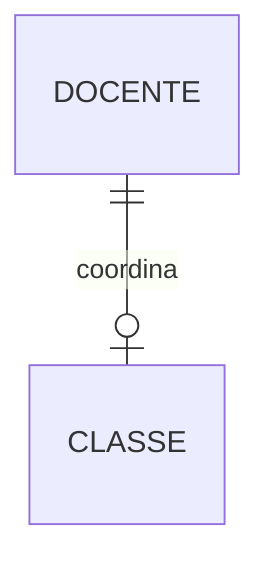
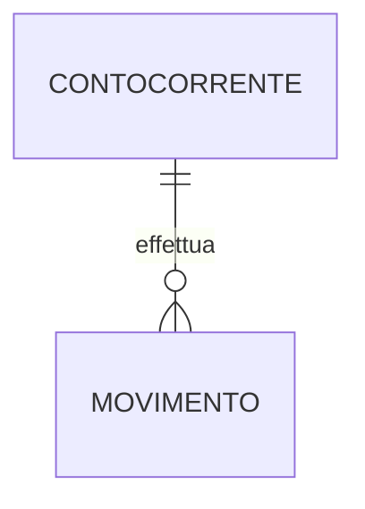
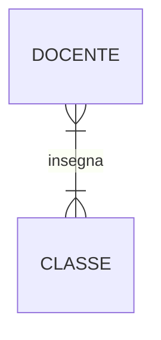
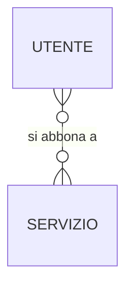

# Esercizi svolti — Individuazione di entità e associazioni

> **Corso:** Informatica (Programmazione) · Anno 5 · Modulo 1 · Lezione 02 — Diagrammi E/R
> **File:** `pr-a5-m1-l02-es-individuazione-entita-associazioni.md`
> **Percorso repository suggerito:** `programmazione-labs/a5-m1-l02/`
>
> I diagrammi in questo file sono scritti in sintassi [Mermaid](https://mermaid.js.org/syntax/entityRelationshipDiagram.html): GitHub li renderizza automaticamente nella pagina del repository, senza bisogno di immagini esterne.

## Come leggere gli esercizi

Per ogni esercizio seguiamo sempre lo stesso metodo, in quattro passi:

1. **Individuazione di entità e associazione** — cosa sono gli oggetti coinvolti, e come si chiama la relazione tra loro
2. **Analisi dell'associazione in un senso** — presa un'istanza della prima entità, quante istanze della seconda entità può coinvolgere? Da qui ricaviamo il numero minimo di istanze e la **molteplicità** (uno-a-uno, uno-a-molti, molti-a-molti)
3. **Analisi dell'associazione nell'altro senso** — presa un'istanza della seconda entità, quante istanze della prima entità può coinvolgere? Da qui ricaviamo se la **partecipazione è obbligatoria o facoltativa** e la **cardinalità** completa (minimo, massimo)
4. **Disegno dello schema E/R**

Ricorda la convenzione che useremo per la cardinalità (min, max) scritta accanto a un'entità: indica **quante istanze dell'altra entità** sono associate a **una singola istanza di questa entità**.

---

## Esercizio 1 — Coordinamento di una classe

**Testo.** In una scuola, ogni classe ha un docente coordinatore. Un docente può coordinare al più una classe (anche nessuna, se non ricopre questo ruolo).

### Analisi

**Entità individuate:** `DOCENTE`, `CLASSE`
**Associazione:** `COORDINA`

**Analisi dell'associazione in un senso — da DOCENTE a CLASSE.**
Presa un'istanza di DOCENTE, quante istanze di CLASSE coordina? Nella pratica scolastica un docente può coordinare **una sola classe**, ma non tutti i docenti sono coordinatori: un docente può anche non coordinare nessuna classe.
- Numero minimo di istanze: **0** (non tutti i docenti coordinano una classe)
- Numero massimo di istanze: **1** (un docente coordina al più una classe)
- Molteplicità: **zero-a-uno**

**Analisi dell'associazione nell'altro senso — da CLASSE a DOCENTE.**
Presa un'istanza di CLASSE, quante istanze di DOCENTE la coordinano? Ogni classe **deve avere sempre** un coordinatore, e ne ha **esattamente uno**: non può essere scoperta, e non può averne due contemporaneamente.
- Partecipazione: **obbligatoria** (ogni classe ha sempre un coordinatore)
- Cardinalità: **(1,1)**

Riassumendo: `DOCENTE` partecipa con cardinalità **(0,1)**, `CLASSE` partecipa con cardinalità **(1,1)**.

### Schema E/R

*(Lettura del diagramma: un DOCENTE coordina zero o una CLASSE; una CLASSE è coordinata da esattamente un DOCENTE.)*

---

## Esercizio 2 — Movimenti del conto corrente

**Testo.** Una banca vuole registrare i movimenti (versamenti, prelievi, bonifici) effettuati sui conti correnti dei propri clienti.

### Analisi

**Entità individuate:** `CONTOCORRENTE`, `MOVIMENTO`
**Associazione:** `EFFETTUARE`

**Analisi dell'associazione in un senso — da CONTOCORRENTE a MOVIMENTO.**
Presa un'istanza di CONTOCORRENTE, quanti MOVIMENTO ha effettuato? Un conto corrente può avere molti movimenti nel tempo, ma può anche non averne ancora nessuno (ad esempio appena aperto, prima della prima operazione).
- Numero minimo di istanze: **0** (un conto appena aperto non ha ancora movimenti)
- Numero massimo di istanze: **N** (nessun limite superiore al numero di movimenti)
- Molteplicità: **zero-a-molti**

**Analisi dell'associazione nell'altro senso — da MOVIMENTO a CONTOCORRENTE.**
Presa un'istanza di MOVIMENTO, a quanti CONTOCORRENTE è associata? Ogni movimento **deve** appartenere a un conto corrente — non ha senso un movimento "senza conto" — ed è relativo a **uno e un solo** conto.
- Partecipazione: **obbligatoria** (ogni movimento appartiene sempre a un conto)
- Cardinalità: **(1,1)**

Riassumendo: `CONTOCORRENTE` partecipa con cardinalità **(0,N)**, `MOVIMENTO` partecipa con cardinalità **(1,1)**.

### Schema E/R

*(Lettura del diagramma: un CONTOCORRENTE effettua zero o più MOVIMENTI; un MOVIMENTO è effettuato da esattamente un CONTOCORRENTI.)*

---

## Esercizio 3 — Insegnare in più classi

**Testo.** In una scuola, ogni docente insegna in una o più classi; ogni classe, a sua volta, ha più docenti (uno per ciascuna materia).

### Analisi

**Entità individuate:** `DOCENTE`, `CLASSE`
**Associazione:** `INSEGNA`

**Analisi dell'associazione in un senso — da DOCENTE a CLASSE.**
Presa un'istanza di DOCENTE, in quante CLASSE insegna? Un docente in servizio insegna sempre in almeno una classe, e tipicamente in più di una.
- Numero minimo di istanze: **1** (un docente in servizio insegna in almeno una classe)
- Numero massimo di istanze: **N** (può insegnare in molte classi)
- Molteplicità: **uno-a-molti**

**Analisi dell'associazione nell'altro senso — da CLASSE a DOCENTE.**
Presa un'istanza di CLASSE, quanti DOCENTE vi insegnano? Una classe ha sempre più di un insegnante (uno per materia), quindi almeno uno, e in generale molti.
- Partecipazione: **obbligatoria** (ogni classe ha sempre almeno un docente)
- Cardinalità: **(1,N)**

Riassumendo: sia `DOCENTE` sia `CLASSE` partecipano con cardinalità **(1,N)**: è un caso di associazione **molti-a-molti**, a differenza dei due esercizi precedenti.

### Schema E/R

*(Lettura del diagramma: un DOCENTE insegna in una o più CLASSI; una CLASSE ha uno o più DOCENTI.)*

> **Nota didattica.** Questo esercizio è un buon confronto con l'Esercizio 1: stesse due entità (DOCENTE e CLASSE), ma un'associazione diversa (INSEGNA invece di COORDINA) porta a una molteplicità completamente diversa (molti-a-molti invece di zero-a-uno/uno). È la prova che la molteplicità dipende dal **significato** dell'associazione, non dalle entità coinvolte.

---

## Esercizio 4 — Abbonamento ai servizi di un provider

**Testo.** Un provider di telecomunicazioni offre diversi servizi (linea internet, telefonia mobile, streaming TV...). Ogni utente può sottoscrivere l'abbonamento a più servizi; ogni servizio può essere sottoscritto da più utenti.

### Analisi

**Entità individuate:** `UTENTE`, `SERVIZIO`
**Associazione:** `ABBONARSI`

**Analisi dell'associazione in un senso — da UTENTE a SERVIZIO.**
Presa un'istanza di UTENTE, a quanti SERVIZIO è abbonato? Un utente registrato nel sistema potrebbe non essersi ancora abbonato a nulla, oppure essere abbonato a più servizi contemporaneamente.
- Numero minimo di istanze: **0** (un utente registrato potrebbe non avere ancora nessun abbonamento attivo)
- Numero massimo di istanze: **N** (può abbonarsi a più servizi)
- Molteplicità: **zero-a-molti**

**Analisi dell'associazione nell'altro senso — da SERVIZIO a UTENTE.**
Presa un'istanza di SERVIZIO, quanti UTENTE vi sono abbonati? Un servizio appena lanciato potrebbe non avere ancora abbonati, oppure averne molti.
- Partecipazione: **facoltativa** (un servizio può non avere ancora nessun abbonato)
- Cardinalità: **(0,N)**

Riassumendo: sia `UTENTE` sia `SERVIZIO` partecipano con cardinalità **(0,N)**: anche questo è un caso **molti-a-molti**, ma — a differenza dell'Esercizio 3 — con partecipazione facoltativa su entrambi i lati.

### Schema E/R

*(Lettura del diagramma: un UTENTE si abbona a zero o più SERVIZI; un SERVIZIO è sottoscritto da zero o più UTENTI.)*

---

## Tabella riepilogativa

| Esercizio | Entità | Associazione | Molteplicità | Partecipazione |
|---|---|---|---|---|
| 1. Coordinamento classe | DOCENTE, CLASSE | COORDINA | zero-a-uno / uno | facoltativa (DOCENTE), obbligatoria (CLASSE) |
| 2. Movimenti c/c | CONTOCORRENTE, MOVIMENTO | EFFETTUARE | zero-a-molti / uno | facoltativa (CONTOCORRENTE), obbligatoria (MOVIMENTO) |
| 3. Insegnare in classi | DOCENTE, CLASSE | INSEGNA | molti-a-molti | obbligatoria su entrambi i lati |
| 4. Abbonamento servizi | UTENTE, SERVIZIO | ABBONARSI | molti-a-molti | facoltativa su entrambi i lati |

> **Da notare:** i quattro esercizi coprono sistematicamente le quattro combinazioni possibili di cardinalità minima (0 oppure 1) sui due lati di un'associazione — è utile, quando li assegni, farlo notare esplicitamente in classe: non sono quattro casi scollegati, ma quattro varianti dello stesso schema concettuale.
